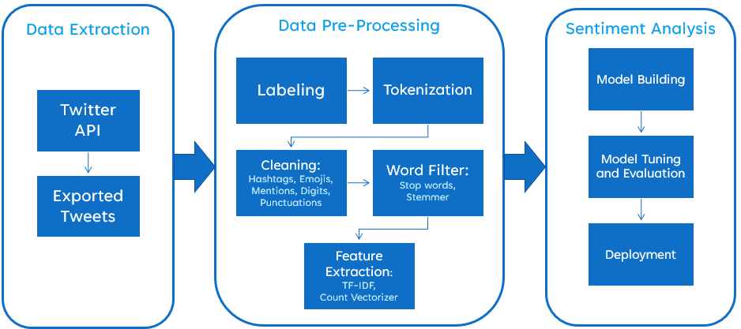
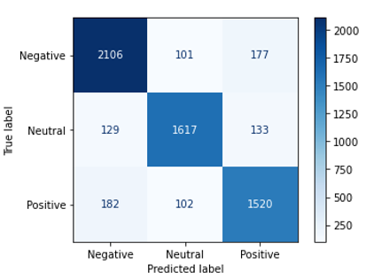
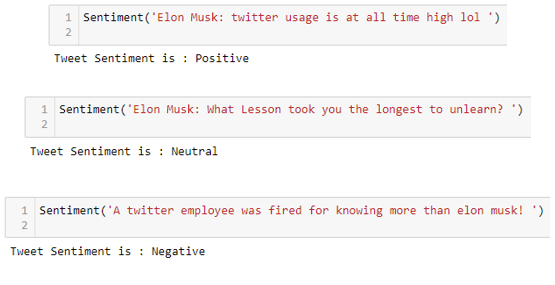

# Twitter Sentiment Analysis

The goal of this project is to create a model that can predict and automate the sentiment analysis of tweets on behalf of hypothetical company to track people's opinion aboout their company in real time.

## The Problem

Elon Musk bought twitter for $44B on 27th of October 2022. And as the new owner he instantly set new policies and rules such as policies on misinformation and charging $8 for verifications. The move that could make it even harder to identify reliable sources. That has left Twitter’s users, advertisers and employees to parse his every move in an effort to guess where he might take the company. So, every bad decision can lead to loosing users and customers. Services that offer alternatives to twitter are seeing the moment as a unique opportunity to entice new or unsatisfied users. 

So, what is the solution! One of the biggest solutions is, Sentiment Analysis. Creating online spaces that foster free expression and human rights is not a zero sum game, it’s a constant balancing act. Analyzing sentiment of the brand over time will keep your finger on the pulse of customers’ thoughts and feelings, as they relate directly to your brand’s image and performance. 
Sentiment analysis can help you detect problems right away. It can also track your campaigns with analysis of reactions. You can find out what customers are saying right after lunching new rule or feature and finally with machine learning and targeted sentiment analysis, you will know where you brand stands on a day-to-day basis.

## The Data

So for this project I used more than 30K tweets extracted directly from twitter  API in the period between October 30th to November 6th. And for the sake of simplicity of this project I ignored the number of favorites or likes, number of retweets and number of followers.

## Model Building

With NLP, Computers are taught to understand human language, its meaning and sentiments. In order to translate complex natural human language into systematic constructed features, we need to follow some major steps shown on this slide. First, I used the Twitter API to extract tweets based on pre-set criteria. Then I labeled the data with Vader analyzer. After tokenization of tweets I remove unnecessary stuff like hashtags, URL’s, numbers and punctuations and then filter the words using stop words and stemmer. Then vectorizing the words to be machine readable. Finally, building models and Tuning them based on performance followed by deployment at the end.  

## Results

After grid searching between number of vectorizers and classifiers, my best model used Count vectorizing with n-grams of 1 meaning there is no relationship between co-occurring words and sentiment. Interestingly, my simplest model which is Logistic Regression, has the best result, with the accuracy of 86%. Not a bad result considering the fact that, the prediction inherited the in-accuracy that Labeling process has in its nature. 
Below is the confusion matrix of my best model.

After finding the best model, I used it on some of the latest tweets circling around in twitter to find the sentiment of those to kind of test my model.
In this slide, you can see the model did pretty good job in recognizing the sentiment of the different sentiment. It is also interesting to know that in the first screenshot, if you delete lol, the sentiment becomes Neutral while the sentence is just informative.

## Next Steps, Recommendations

And finally, let’s talk about my recommendations and some future works that can be done.
Well, having better labeling process can hugely improve the model performance. since I ignored the number of favourite, retweets and followers for simplicity, the next thing we can do is just taking those into account. Knowing the Geolocation of each tweet can be also helpful to identify associated reasons of those sentiments.
We should also keep feeding the training model that it can be able to calibrate itself even more.
Considering sentiment analysis of other platforms also might be beneficial.

As Elon Musk said “the bird is freed”. Let’s see where it goes.

## Repository Structure and Navigation

| File                                | Description                                                                              |
| ----------------------------------- | ---------------------------------------------------------------------------------------- |
| Data                                | A file to hold data files.                                                               |
| Models                              | A file to hold the best model.                                                           |
| Images                              | A file to hold the images of README file.                                                |
| Extracting_Tweets.ipynb             | the notebook to extract tweets from Twitter API.                                         |
| Master_Notebook.ipynb               | My final notebook, with metrics and analysis and the final model.                        |

